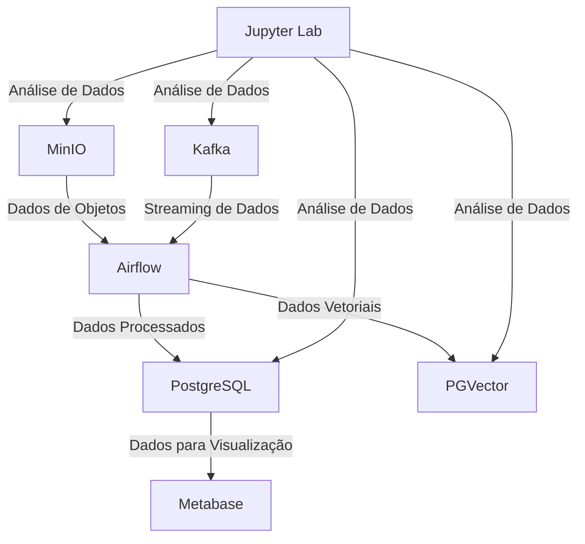

# Data Pipeline Minikube Terraform


**Data Pipeline Minikube Terraform** é uma prova de conceito (PoC) para a construção de um pipeline de dados moderno, utilizando ferramentas open-source e infraestrutura como código. O projeto combina **Terraform** e **Docker Compose** para configurar um ambiente completo de forma automatizada, ideal para aprendizado, experimentação e desenvolvimento de pipelines de dados.

Este projeto foi desenvolvido para demonstrar a integração de ferramentas populares em um ambiente local, simulando cenários reais de ingestão, armazenamento, processamento e visualização de dados. Ele é perfeito para estudantes, engenheiros de dados e entusiastas que desejam explorar um pipeline completo.

## Funcionalidades

-   **Infraestrutura como Código**: Terraform gerencia volumes e redes no Minikube.
-   **Armazenamento de Objetos**: MinIO simula o AWS S3.
-   **Mensageria**: Apache Kafka com Zookeeper para streaming de dados.
-   **Orquestração**: Apache Airflow para gerenciar pipelines.
-   **Bancos de Dados**:
    -   PostgreSQL para armazenamento relacional.
    -   PGVector para dados vetoriais.
-   **Visualização**: Metabase para análises e dashboards.
-   **Interface de Mensageria**: Kafka UI para monitoramento de tópicos.
-   **Análise de Dados**: Jupyter Lab com suporte a Python e bibliotecas de dados.

## Arquitetura

O projeto inclui os seguintes serviços, todos conectados via uma rede Docker (app-network):

1.  **MinIO**: Armazenamento de objetos compatível com S3.
2.  **Apache Kafka & Zookeeper**: Sistema de mensageria para streaming.
3.  **Apache Airflow**: Orquestração de pipelines de dados.
4.  **PostgreSQL**: Banco relacional com os bancos airflow, metabase data marts.
5.  **PGVector**: Banco vetorial para dados de embeddings.
6.  **Metabase**: Ferramenta de visualização open-source.
7.  **Kafka UI**: Interface para gerenciar clusters Kafka.
8.  **Jupyter Lab**: Ambiente interativo para análise de dados.
9.  **init-permissions**: Serviço auxiliar para configurar permissões do Airflow.


# Configuração de Ambiente de Desenvolvimento Local com Terraform

Este guia descreve como configurar um ambiente de desenvolvimento local no Ubuntu 24.10, simulando serviços AWS (S3 com MinIO e EKS com Minikube) usando Terraform para provisionamento. O ambiente incluirá MinIO, Apache Kafka, Apache Airflow, PGVector, PostgreSQL, Metabase, Kafka UI e Jupyter Labs, todos integrados e versionáveis em Git.

## Pré-requisitos

Antes de começar, certifique-se de que o sistema está limpo e atualizado. Execute os seguintes comandos:

```bash
sudo apt update && sudo apt upgrade -y
sudo apt install -y curl wget git unzip
```

## Passo 1: Estrutura do Projeto

Crie uma estrutura de diretórios para o projeto, que será versionável em Git:

```bash
mkdir -p ~/data-pipeline-local/{terraform,kubernetes,scripts}
cd ~/data-pipeline-local
git init
```

Crie um arquivo `.gitignore`:

```bash
echo -e "terraform/.terraform/\nterraform/terraform.tfstate\nterraform/terraform.tfstate.backup" > .gitignore
```

## Passo 2: Instalação das Ferramentas Necessárias

### 2.1 Instalar Terraform

Baixe e instale o Terraform:

```bash
wget https://releases.hashicorp.com/terraform/1.9.7/terraform_1.9.7_linux_amd64.zip
unzip terraform_1.9.7_linux_amd64.zip
sudo mv terraform /usr/local/bin/
terraform --version
rm terraform_1.9.7_linux_amd64.zip
```

### 2.2 Instalar Minikube

Instale o Minikube para simular o EKS:

```bash
curl -LO https://storage.googleapis.com/minikube/releases/latest/minikube-linux-amd64
sudo install minikube-linux-amd64 /usr/local/bin/minikube
```

### 2.3 Instalar kubectl

Instale o `kubectl` para interagir com o Minikube:

```bash
curl -LO "https://dl.k8s.io/release/$(curl -L -s https://dl.k8s.io/release/stable.txt)/bin/linux/amd64/kubectl"
sudo install kubectl /usr/local/bin/
kubectl version --client
```

### 2.4 Instalar Helm

Instale o Helm para gerenciar pacotes no Kubernetes:

```bash
curl https://raw.githubusercontent.com/helm/helm/main/scripts/get-helm-3 | bash
helm version
```

### 2.5 Instalar Dependências do Sistema

Instale dependências adicionais:

```bash
sudo apt install -y docker.io
sudo usermod -aG docker $USER
newgrp docker
```

## Passo 3: Configuração do Minikube

Inicie o Minikube com recursos suficientes para suportar todos os serviços:

```bash
minikube start --driver=docker --memory=8192 --cpus=4
minikube addons enable ingress
```

## Passo 4: Configuração do Terraform

Crie os arquivos Terraform na pasta `terraform/`.

### 4.1 Arquivo `providers.tf`

```hcl
terraform {
  required_providers {
    kubernetes = {
      source  = "hashicorp/kubernetes"
      version = "~> 2.23"
    }
    helm = {
      source  = "hashicorp/helm"
      version = "~> 2.11"
    }
  }
}

provider "kubernetes" {
  host                   = "https://${data.external.minikube_ip.result.ip}:8443"
  client_certificate     = file("~/.minikube/profiles/minikube/client.crt")
  client_key             = file("~/.minikube/profiles/minikube/client.key")
  cluster_ca_certificate = file("~/.minikube/ca.crt")
}

provider "helm" {
  kubernetes {
    host                   = "https://${data.external.minikube_ip.result.ip}:8443"
    client_certificate     = file("~/.minikube/profiles/minikube/client.crt")
    client_key             = file("~/.minikube/profiles/minikube/client.key")
    cluster_ca_certificate = file("~/.minikube/ca.crt")
  }
}

data "external" "minikube_ip" {
  program = ["bash", "-c", "echo {\"ip\": \"$(minikube ip)\"}"]
}
```

### 4.2 Arquivo `minio.tf`

Configure o MinIO para simular o S3:

```hcl
resource "helm_release" "minio" {
  name       = "minio"
  repository = "https://charts.min.io/"
  chart      = "minio"
  namespace  = "minio"
  create_namespace = true

  set {
    name  = "mode"
    value = "standalone"
  }
  set {
    name  = "resources.requests.memory"
    value = "512Mi"
  }
  set {
    name  = "persistence.enabled"
    value = "true"
  }
  set {
    name  = "rootUser"
    value = "admin"
  }
  set {
    name  = "rootPassword"
    value = "password"
  }
}
```

### 4.3 Arquivo `kafka.tf`

Configure o Apache Kafka:

```hcl
resource "helm_release" "kafka" {
  name       = "kafka"
  repository = "https://charts.bitnami.com/bitnami"
  chart      = "kafka"
  namespace  = "kafka"
  create_namespace = true

  set {
    name  = "replicaCount"
    value = "1"
  }
  set {
    name  = "persistence.enabled"
    value = "true"
  }
}
```

### 4.4 Arquivo `airflow.tf`

Configure o Apache Airflow:

```hcl
resource "helm_release" "airflow" {
  name       = "airflow"
  repository = "https://airflow.apache.org"
  chart      = "airflow"
  namespace  = "airflow"
  create_namespace = true

  set {
    name  = "executor"
    value = "KubernetesExecutor"
  }
  set {
    name  = "webserver.defaultUser.enabled"
    value = "true"
  }
  set {
    name  = "webserver.defaultUser.username"
    value = "admin"
  }
  set {
    name  = "webserver.defaultUser.password"
    value = "admin"
  }
}
```

### 4.5 Arquivo `postgres.tf`

Configure o PostgreSQL e o PGVector:

```hcl
resource "helm_release" "postgresql" {
  name       = "postgresql"
  repository = "https://charts.bitnami.com/bitnami"
  chart      = "postgresql"
  namespace  = "postgres"
  create_namespace = true

  set {
    name  = "global.postgresql.auth.postgresPassword"
    value = "postgres"
  }
}

resource "helm_release" "pgvector" {
  name       = "pgvector"
  repository = "https://charts.bitnami.com/bitnami"
  chart      = "postgresql"
  namespace  = "pgvector"
  create_namespace = true

  set {
    name  = "global.postgresql.auth.postgresPassword"
    value = "pgvector"
  }
  set {
    name  = "primary.initdb.scripts.init.sql"
    value = "CREATE EXTENSION vector;"
  }
}
```

### 4.6 Arquivo `metabase.tf`

Configure o Metabase:

```hcl
resource "helm_release" "metabase" {
  name       = "metabase"
  repository = "https://helm.metabase.com"
  chart      = "metabase"
  namespace  = "metabase"
  create_namespace = true
}
```

### 4.7 Arquivo `kafka-ui.tf`

Configure o Kafka UI:

```hcl
resource "helm_release" "kafka-ui" {
  name       = "kafka-ui"
  repository = "https://provectus.github.io/kafka-ui-charts"
  chart      = "kafka-ui"
  namespace  = "kafka-ui"
  create_namespace = true

  set {
    name  = "yamlApplicationConfig.kafka.clusters[0].name"
    value = "local"
  }
  set {
    name  = "yamlApplicationConfig.kafka.clusters[0].bootstrapServers"
    value = "kafka:9092"
  }
}
```

### 4.8 Arquivo `jupyter.tf`

Configure o Jupyter Labs:

```hcl
resource "helm_release" "jupyter" {
  name       = "jupyter"
  repository = "https://jupyterhub.github.io/helm-chart/"
  chart      = "jupyterhub"
  namespace  = "jupyter"
  create_namespace = true

  set {
    name  = "singleuser.image.name"
    value = "jupyter/datascience-notebook"
  }
  set {
    name  = "singleuser.image.tag"
    value = "latest"
  }
}
```

## Passo 5: Integração dos Serviços

### 5.1 Conexão do Airflow com MinIO

Adicione configurações no Airflow para acessar o MinIO como backend S3:

```hcl
resource "helm_release" "airflow" {
  # ... configuração anterior ...
  set {
    name  = "config.AWS_S3_CONNECTION"
    value = "s3://admin:password@minio.minio.svc.cluster.local:9000"
  }
}
```

### 5.2 Conexão do Airflow com Kafka

Configure o Airflow para consumir mensagens do Kafka:

```hcl
resource "helm_release" "airflow" {
  # ... configuração anterior ...
  set {
    name  = "config.KAFKA_BROKER"
    value = "kafka:9092"
  }
}
```

### 5.3 Conexão do Metabase com PostgreSQL

O Metabase detectará automaticamente o PostgreSQL na rede. Certifique-se de que o namespace `postgres` esteja acessível.

### 5.4 Conexão do Jupyter com MinIO e PostgreSQL

Use bibliotecas Python como `boto3` (com endpoint do MinIO) e `psycopg2` no Jupyter para acessar o MinIO e PostgreSQL.

## Passo 6: Aplicação do Terraform

Inicialize e aplique o Terraform:

```bash
cd ~/data-pipeline-local/terraform
terraform init
terraform apply -auto-approve
```

## Passo 7: Acessando os Serviços

Obtenha os endereços dos serviços:

```bash
minikube service list
```

- **MinIO**: Acesse em `http://<minikube-ip>:9000` (admin/password).
- **Airflow**: Acesse a UI em `http://<minikube-ip>:8080` (admin/admin).
- **Metabase**: Acesse em `http://<minikube-ip>:3000`.
- **Kafka UI**: Acesse em `http://<minikube-ip>:8080`.
- **Jupyter**: Acesse em `http://<minikube-ip>:8888`.

## Passo 8: Versionamento no Git

Adicione os arquivos ao Git e faça o commit inicial:

```bash
git add .
git commit -m "Configuração inicial do ambiente de pipeline de dados com Terraform"
```

## Passo 9: Testando a Integração

1. Crie um bucket no MinIO via UI ou CLI.
2. Configure um DAG no Airflow para ler do MinIO e enviar mensagens ao Kafka.
3. Use o Kafka UI para verificar as mensagens.
4. No Jupyter, conecte-se ao PostgreSQL e PGVector para análises.
5. Configure o Metabase para visualizar dados do PostgreSQL.

## Passo 10: Encerramento

Para parar o ambiente:

```bash
minikube stop
```

Para destruir os recursos:

```bash
terraform destroy -auto-approve
minikube delete
```

## Notas Finais

- Este ambiente é adequado para desenvolvimento local e testes. Para produção, ajuste os recursos e adicione segurança (e.g., senhas fortes, segredos gerenciados).
- Monitore o uso de recursos do Minikube, pois múltiplos serviços podem ser intensivos.
- Considere usar `docker-compose` para serviços leves se o Minikube for muito pesado.